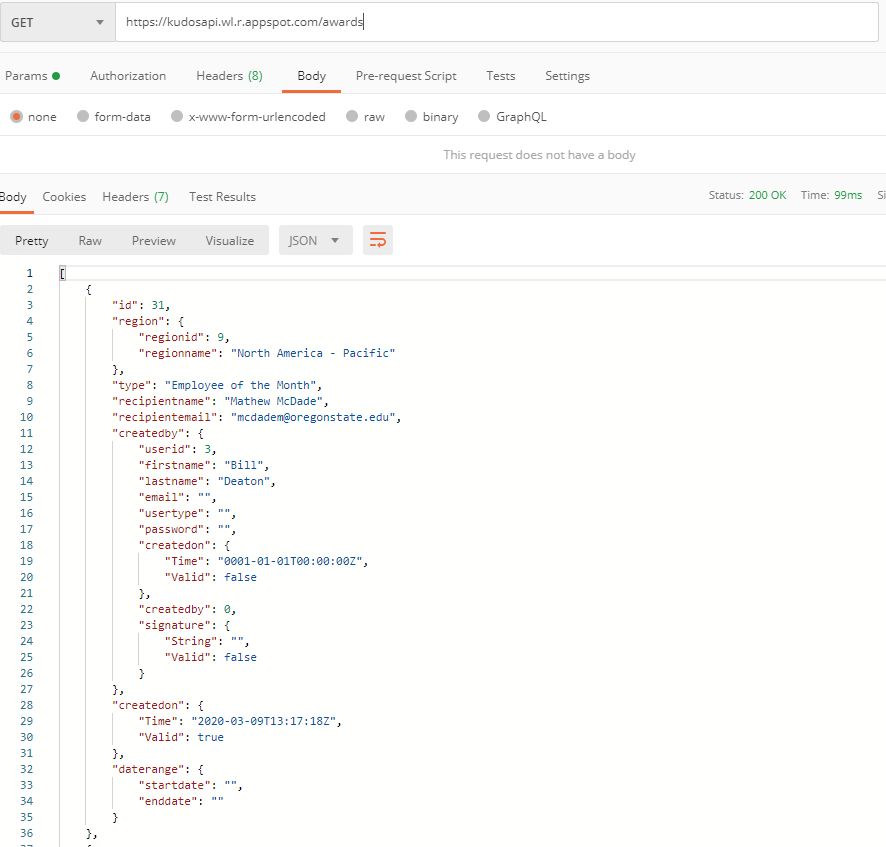
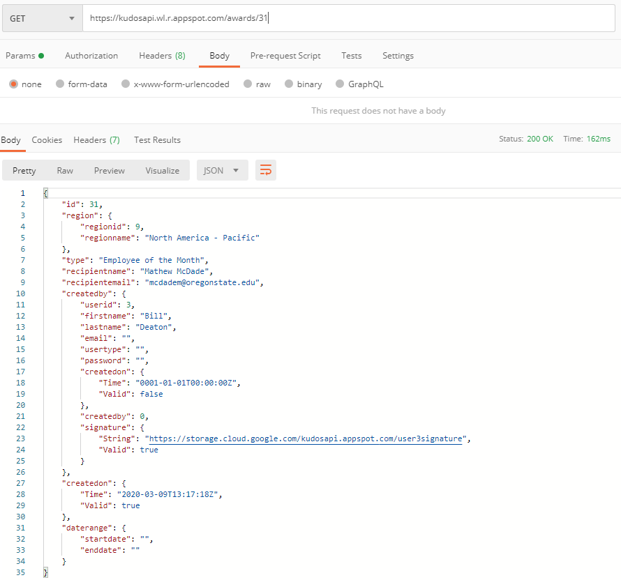
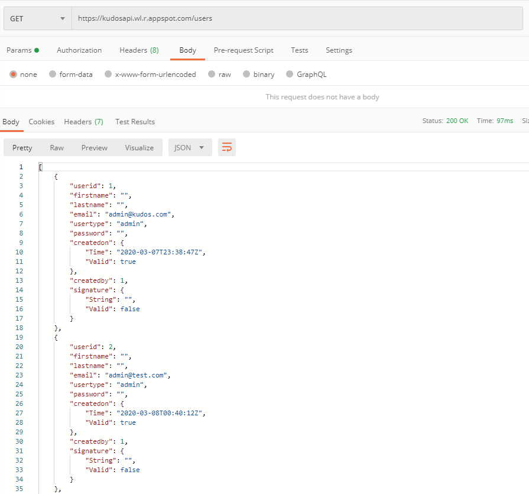
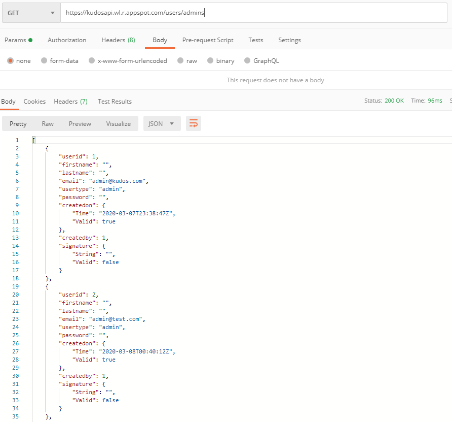
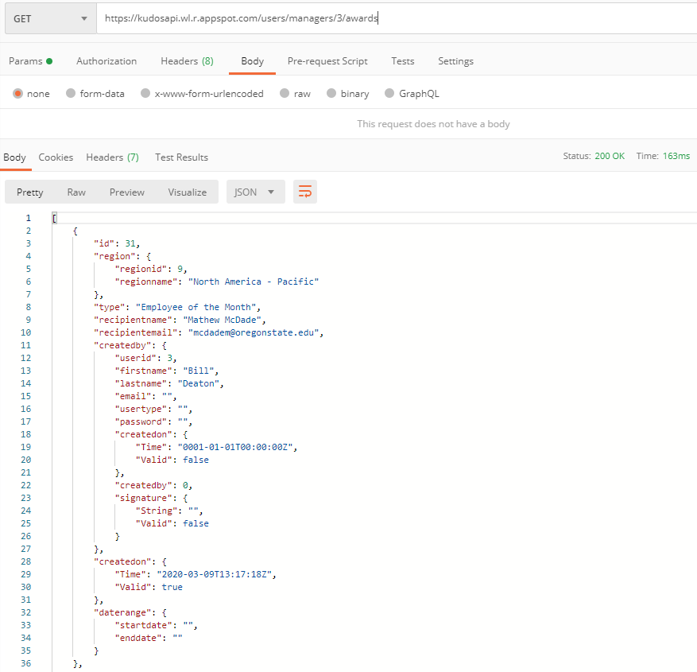
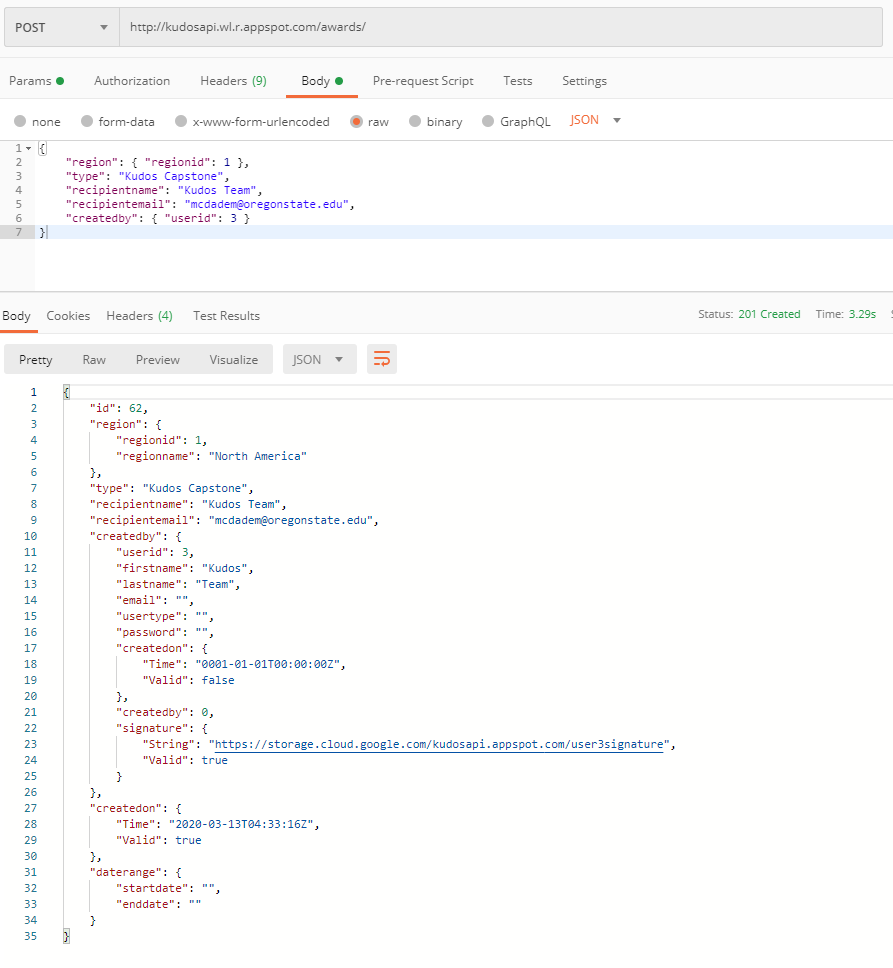
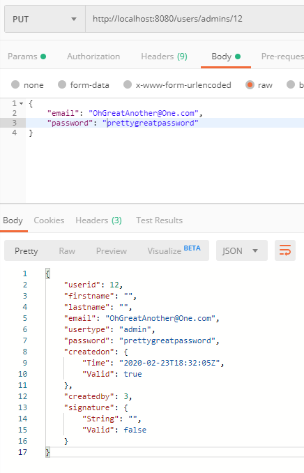
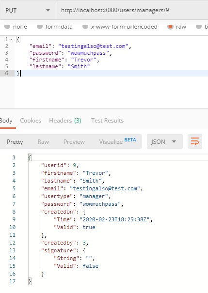
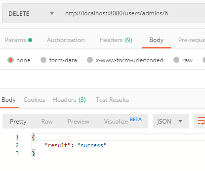

# KudosApi
## Data Objects
#### award
#### user
#### manager
#### admin
## Endpoints
###### Note: localhost:8080 replaced by kudosapi.wl.r.appspot.com in deployment.
## Get Things
- GET /awards
    - returns JSON list of award objects.
    - 
- GET /awards/{id}
    - returns JSON award object specified by unique identifier, id.
    - 
- GET /users
    - returns JSON list of user objects.
    - 
- GET /users/{email}
    - returns JSON user object specified by unique identifier, email.
    - 
- GET /users/admins
    - returns JSON list of admin objects.
    - 
- GET /users/admins/{id}
    - returns JSON admin object specified by unique identifier, id.
    - 
- GET /users/managers
    - returns JSON list of manager objects.
    - 
- GET /users/managers/{id}
    - returns JSON manager object specified by unique identifier, id.
    - 
- GET /users/managers/{id}/awards
    - returns JSON list of award objects specified by unique manager identifier, id.
    - 
### *Search Awards*
- GET /awards/search?
    - query parameters (all optional; all except startdate/enddate will partial match):
        - startdate: beginning of search date range, will default to Jan 1, 2000.
        - enddate: end of search date range, defaults to the current time when request is received.
        - awardtype: name or partial name of the award e.g. "Manager of the", "of the Month", etc.
        - regionname: name or partial name of the region e.g. "North America", "US East", etc.
        - recipientname: name or partial name of award recipient.
        - recipientemail: name or partial email address of recipient.
- GET /awards/search
    - with no parameters specified, returns all awards created between Jan 1, 2000 and the current time.
    - 
###### Mix and match params, collect em all!
- GET /awards/search?startdate=2020-02-01&enddate=2020-02-29&awardtype=of the
    - 
- GET /awards/search?startdate=2020-02-01&enddate=2020-02-29&regionname=US East
    - 

## Post Things
- POST /awards/
    - creates a new award with request body data and returns unique row id.
    - FUTURE: will trigger certificate generation and email functionality.
    -  
- POST /users/managers
    - creates a new manager with request body data and returns unique row id.
    - 
- POST /users/admins
    - creates a new admin with request body data and returns unique row id.
    - 
## Put Things
- PUT /users/admins/{id}
    - modifies an admin specified by unique identifier, id, and returns the modified JSON object.
    - 
- PUT /users/managers/{id}
    - modifies a manager specified by unique identifier, id, and returns the modified JSON object.
    - 
## Delete Things
- DELETE /awards/{id}
    - deletes the award row specified by unique identifier, id, from the database.
    - 
- DELETE /users/admins/{id}
    - deletes the user row specified by unique identifier, id, as well as rows referencing that id as a foreign key from the database.
    - 
- DELETE /users/managers/{id}
    - deletes the user row specified by unique identifier, id, as well as rows referencing that id as a foreign key from the database.
    - 